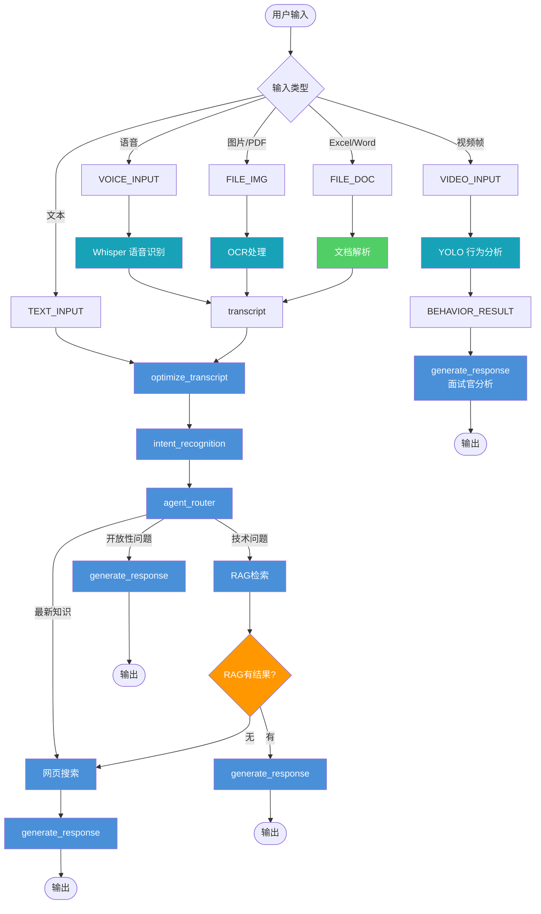
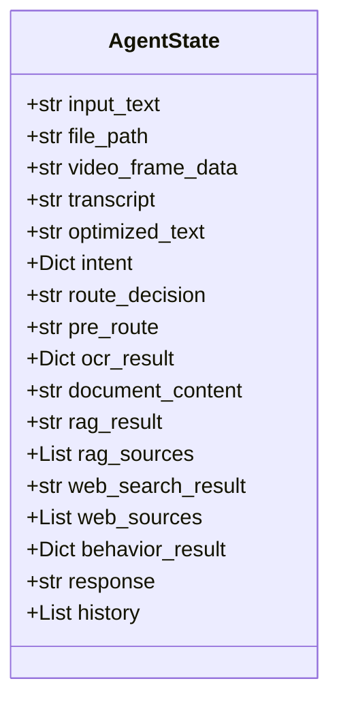
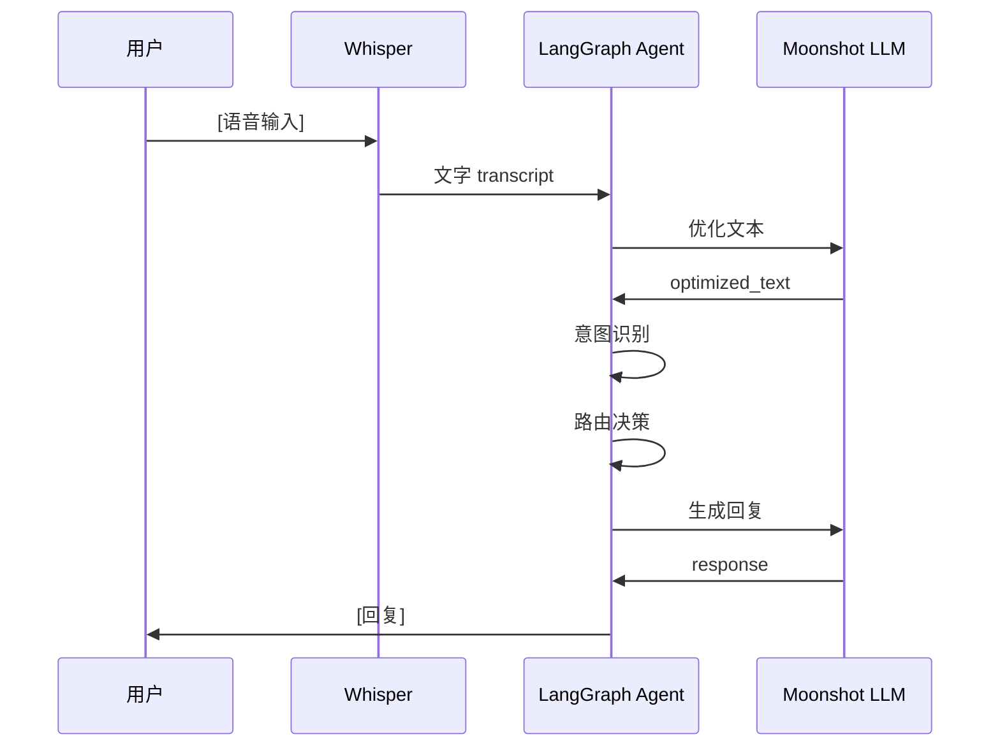
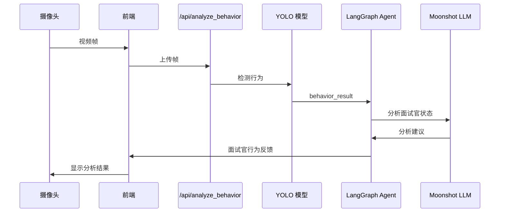
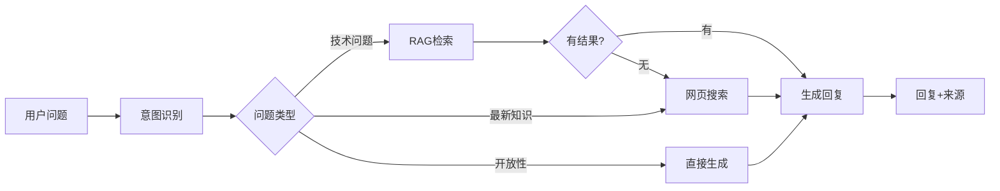

***

name: langchain-ai-stack
description: 基于 LangGraph 的面试助手智能体，支持语音问答（中英双语）、面试官行为分析（YOLO）、智能路由问答、RAG 检索增强、网页搜索。
-----------------------------------------------------------------------------------

# LangChain AI Stack - 面试助手智能体

## Overview

基于 **LangGraph** 的智能面试助手，帮助你（面试者）回答面试官问题。

**核心功能：**

- 语音问答（中英双语）
- 面试官行为分析（YOLO）
- 智能问答路由
- 文件处理（OCR/文档解析）
- 面试场景专业回复

***

## 快速启动

### Step 1: 安装依赖

```bash
cd LangChain-AI-Stack
pip install -r requirements.txt
```

### Step 2: 配置环境变量

创建 `.env` 文件：

```env
MOONSHOT_API_KEY=your_moonshot_api_key
TAVILY_API_KEY=your_tavily_api_key
SPEECH_ENGINE=funasr
```

### Step 3: 启动服务

```bash
# 终端 1: 后端 API
python -m src.main

# 终端 2: 前端界面
cd src/ui && python -m http.server 8080
```

**首次使用语音识别会自动下载模型（约 944MB），存放在：**

- `~/.cache/modelscope/hub/models/iic/speech_seaco_paraformer_large_asr_nat-zh-cn-16k-common-vocab8404-pytorch/`

### Step 4: 访问

- API 文档: <http://localhost:8000/docs>
- 前端界面: <http://localhost:8080>

***

## 智能体架构

### 数据流转图



***

## 节点详解

### 节点类型

| 颜色    | 类型               | 说明                           |
| ----- | ---------------- | ---------------------------- |
| 🔵 蓝色 | LLM Node         | 云端大语言模型调用                    |
| 🩵 青色 | Local Model Node | 本地模型（Whisper/YOLO/PaddleOCR） |
| 🟢 绿色 | Tool Node        | 纯功能/工具节点                     |
| 🟠 橙色 | Condition Node   | 条件判断节点                       |

***

### 节点列表

| 节点名称                     | 类型           | 输入                                          | 输出                                       | 功能说明                  |
| ------------------------ | ------------ | ------------------------------------------- | ---------------------------------------- | --------------------- |
| `pre_router`             | 🟢 Tool      | input\_text, file\_path, video\_frame\_data | pre\_route                               | 判断输入类型，决定路由           |
| `ocr_processing`         | 🩵 Local     | file\_path                                  | ocr\_result, transcript                  | PaddleOCR 提取图片/PDF 文字 |
| `document_parsing`       | 🟢 Tool      | file\_path                                  | document\_content, transcript            | 解析 Excel/Word 文档      |
| `behavior_detection`     | 🩵 Local     | video\_frame\_data                          | behavior\_result                         | YOLO 分析面试官行为          |
| `process_speech_to_text` | 🟢 Tool      | input\_text, transcript                     | transcript                               | 统一处理文本输入              |
| `optimize_transcript`    | 🔵 LLM       | transcript                                  | optimized\_text                          | LLM 润色/规范化文本          |
| `intent_recognition`     | 🔵 LLM       | optimized\_text                             | intent (question\_type, execution\_plan) | 识别问题类型                |
| `agent_router`           | 🔵 LLM       | intent                                      | route\_decision                          | 根据意图决定路由              |
| `rag_processing`         | 🔵 LLM       | optimized\_text                             | rag\_result, rag\_sources                | RAG 检索本地知识库           |
| `check_rag_result`       | 🟠 Condition | rag\_result                                 | has\_content / no\_content               | 检查 RAG 是否有结果          |
| `web_search`             | 🔵 LLM       | optimized\_text                             | web\_search\_result, web\_sources        | ReAct Agent 网页搜索      |
| `generate_response`      | 🔵 LLM       | context (RAG/网页/行为分析)                       | response                                 | 生成最终回复                |

***

## AgentState 定义



***

## 输入类型与路由

### pre\_router 路由规则

| 输入类型       | 检测条件                                | 路由目标                     |
| ---------- | ----------------------------------- | ------------------------ |
| 视频帧        | video\_frame\_data 非空               | `behavior_detection`     |
| 图片/PDF     | file\_path 扩展名 \[.png/.jpg/.pdf...] | `ocr_processing`         |
| Excel/Word | file\_path 扩展名 \[.xlsx/.docx...]    | `document_parsing`       |
| 文本/语音      | 其他情况                                | `process_speech_to_text` |

### agent\_router 路由规则

| intent.question\_type | 路由目标                | 说明           |
| --------------------- | ------------------- | ------------ |
| 技术问题                  | `rag_processing`    | 从本地知识库检索     |
| 个人问题                  | `rag_processing`    | 从个人简历/项目经验检索 |
| 最新知识                  | `web_search`        | 需要实时信息       |
| 开放性问题                 | `generate_response` | 直接生成回复       |

***

## 典型场景

### 场景 1: 语音问答



### 场景 2: 面试官行为分析



### 场景 3: 技术问题（RAG）



***

## API 端点

| 端点                      | 方法        | 功能              |
| ----------------------- | --------- | --------------- |
| `/ws/chat/{session_id}` | WebSocket | 对话接口            |
| `/api/process_audio`    | POST      | 语音输入（转文字+AI回复）  |
| `/api/speech_to_text`   | POST      | 仅语音转文字          |
| `/api/analyze_behavior` | POST      | 分析面试官行为（视频帧）    |
| `/api/upload_file`      | POST      | 文件上传（自动 OCR/解析） |
| `/api/ocr`              | POST      | 仅 OCR 处理        |
| `/api/parse_document`   | POST      | 仅文档解析           |
| `/api/config`           | GET       | 获取 MCP 配置       |

### 调用示例

**语音问答:**

```bash
curl -X POST http://localhost:8000/api/process_audio \
  -F "audio=@test.wav"
```

**面试官行为分析:**

```javascript
const formData = new FormData();
formData.append('frame', videoFrameBlob);
await fetch('/api/analyze_behavior', {
  method: 'POST',
  body: formData
});
```

**文本对话 (WebSocket):**

```javascript
const ws = new WebSocket('ws://localhost:8000/ws/chat/default');
ws.send(JSON.stringify({
  type: 'chat',
  content: '请介绍一下你自己'
}));
ws.onmessage = (event) => {
  const data = JSON.parse(event.data);
  if (data.type === 'text') {
    console.log('回复:', data.content);
  }
};
```

***

## 前端功能

| 按钮       | 功能                  |
| -------- | ------------------- |
| 发送       | 发送文本消息              |
| 语音输入     | 开始/停止语音录制           |
| 上传文件     | 上传图片/PDF/Excel/Word |
| **视觉分析** | 开启/关闭摄像头，实时分析面试官行为  |
| 重置       | 重置会话                |

***

## 技术栈

| 类别       | 技术                                 |
| -------- | ---------------------------------- |
| Agent 框架 | LangGraph, LangChain               |
| LLM      | Moonshot AI (moonshot-v1-8k)       |
| 语音识别     | Funasr Paraformer (中文, ModelScope) |
| 行为分析     | YOLOv8n (Ultralytics)              |
| OCR      | PaddleOCR                          |
| 向量检索     | FAISS, Sentence Transformers       |
| 搜索       | Tavily API                         |

***

## 项目结构

```
LangChain-AI-Stack/
├── src/
│   ├── main.py                      # FastAPI 主服务入口
│   ├── multi_agent.py              # LangGraph Agent 定义（核心业务逻辑）
│   ├── agent_driver.py              # Agent 驱动工具（事件流处理）
│   ├── speech_recognition/
│   │   ├── speech_to_text.py       # PaddleSpeech 语音识别
│   │   └── sensevoice.py           # Whisper 语音识别
│   ├── behavior_detection/
│   │   └── behavior_analyzer.py    # YOLO 面试官行为分析
│   ├── ocr/
│   │   └── ocr_service.py          # PaddleOCR 文字识别
│   ├── document_parser/
│   │   └── document_parser_service.py  # Excel/Word 文档解析
│   ├── rag/
│   │   └── RAG.py                  # 向量检索增强
│   ├── custom_api_llm/
│   │   └── model.py                 # 自定义 API LLM 模型
│   ├── mcp_server/                  # MCP 工具服务器
│   │   ├── mcp_server_time.py       # 时间工具
│   │   └── mcp_server_web_search.py # 搜索工具
│   └── ui/
│       └── index.html               # 前端界面
├── tests/
│   └── demo/
│       └── easychat.py              # 简单对话示例
├── yolov8n.pt                       # YOLOv8n 行为分析模型（6MB）
├── download_models.py               # 预下载 Funasr 语音模型脚本
├── mcp_config.json                  # MCP 服务器配置
├── requirements.txt                 # Python 依赖
└── README.md
```

***

## 核心模块说明

### 1. main.py - API 服务入口

FastAPI 应用，提供以下主要接口：

- `WebSocket /ws/chat/{session_id}` - 实时对话
- `POST /api/process_audio` - 语音处理（转文字+AI回复）
- `POST /api/analyze_behavior` - 面试官行为分析
- `POST /api/upload_file` - 文件上传（OCR/文档解析）

### 2. multi\_agent.py - 核心 Agent 实现

基于 LangGraph 的智能面试助手，实现以下流程：

- **pre\_router** → 判断输入类型（文本/语音/文件/视频帧）
- **ocr\_processing** → 图片/PDF 文字识别
- **document\_parsing** → Excel/Word 文档解析
- **behavior\_detection** → YOLO 面试官行为分析
- **optimize\_transcript** → LLM 文本润色
- **intent\_recognition** → 意图识别
- **agent\_router** → 智能路由决策
- **rag\_processing** → 本地知识库检索
- **web\_search** → 网页搜索
- **generate\_response** → 生成最终回复

### 3. agent\_driver.py - 事件流驱动

处理 LangGraph Agent 的流式事件，将细粒度执行事件转换为前端可理解的统一消息格式。

### 4. speech\_recognition/ - 语音识别服务

- `sensevoice.py` - Whisper 语音识别（默认引擎）
- `speech_to_text.py` - PaddleSpeech 语音识别

### 5. behavior\_detection/ - 行为分析服务

`behavior_analyzer.py` - YOLOv8n 人体检测 + 姿态/视线/表情分析

***

## 环境变量配置

| 变量名                | 必填 | 说明                             | 默认值              |
| ------------------ | -- | ------------------------------ | ---------------- |
| `MOONSHOT_API_KEY` | 是  | Moonshot AI API 密钥             | -                |
| `TAVILY_API_KEY`   | 否  | Tavily 搜索 API 密钥               | -                |
| `SPEECH_ENGINE`    | 否  | 语音引擎 `funasr` 或 `paddlespeech` | `sensevoice`     |
| `MOONSHOT_MODEL`   | 否  | Moonshot 模型名称                  | `moonshot-v1-8k` |

***


