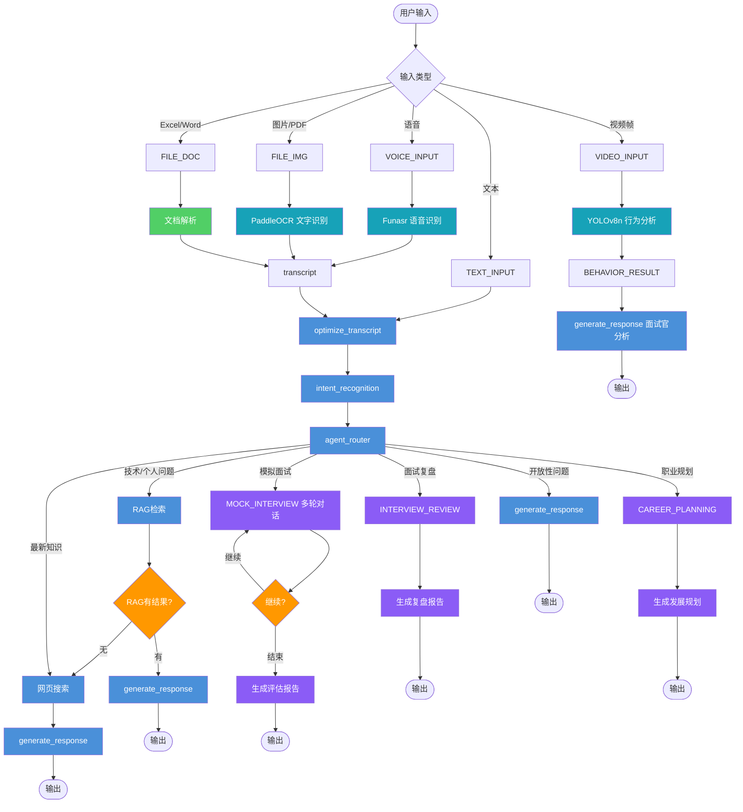

# LangChain AI Stack - AI 面试助手

> 基于 **LangGraph** 的智能面试助手,支持多轮模拟面试、面试复盘、职业规划。
> 单例 Agent + 会话隔离 + 流式事件驱动。

**Contributors:**
[](https://github.com/MM-arthur) · [](https://github.com/openclaw) · **MiniMax-M2**

---

## 核心特性

| 特性 | 说明 |
|------|------|
| 🤝 **模拟面试** | 多轮对话,结束时输出结构化评估报告 |
| 📋 **面试复盘** | 对照 JD/简历,输出技术评分 + 改进建议 |
| 🧭 **职业规划** | 召回简历 + 对话历史,输出个性化发展路径 |
| 🎤 **语音输入** | 实时语音转文字,直接对话 |
| 🧠 **评估历史记忆** | 面试表现自动追踪，topic 级评分 + 趋势分析，AI 出题更有针对性 |
| 📷 **面试官行为分析** | YOLOv8 实时分析表情/视线/姿势/注意力 |
| 📄 **多格式解析** | 图片/ PDF(OCR)/ Excel / Word / PPT |
| 🧠 **个人知识库 RAG** | Arthur 简历 + JD + CSDN 博客 → FAISS 向量检索 |
| 🔍 **实时搜索** | Tavily API 支持最新知识 |
| 💾 **会话持久化** | SqliteSaver,重启不丢对话历史 |

---

## 设计架构

### 单例 Agent + 分层会话

```
进程启动时 → AgentSingleton 编译一次 LangGraph(11节点)
              ↓ session_id
            SessionManager → 每个会话分配独立 SqliteSaver
              ↓
            对话历史 + RAG + MCP工具(均会话隔离)
```

### 意图路由

```
用户输入
  ↓
intent_recognition(LLM识别意图)
  ↓
_get_intent_mode()
  ├── mock_interview    → 多轮模拟面试
  ├── interview_review  → 面试复盘分析
  ├── career_planning   → 职业发展规划
  └── normal_chat       → RAG检索 / 网页搜索 / 直接生成
```

### 数据流

```
文本/语音/视频帧 → pre_router → optimize_transcript
                                      ↓
                              intent_recognition
                                      ↓
                              agent_router → RAG / 搜索 / 生成
                                              ↓
                              WebSocket 流式返回
```

### Agent 节点图



---

## 快速启动

```bash
# 1. 安装依赖
pip install -r requirements.txt

# 2. 配置 .env
MOONSHOT_API_KEY=your_moonshot_api_key

# 3. 启动后端
python -m src.main
# 看到 "[AgentSingleton] LangGraph 编译完成,节点数: 11" 即成功

# 4. 启动前端(另一个终端)
cd src/ui && python -m http.server 8080
```

访问:
- 前端界面:http://localhost:8080
- API 文档:http://localhost:8000/docs

---

## 前端:Apple 设计风格

界面采用 **Apple Design System**,视觉语言:

- **配色**:Apple Blue `#0071E3` + 纯白背景 + 浅灰 `#F5F5F7` 气泡
- **字体**:SF Pro Display → Helvetica Neue 回退
- **布局**:极简留白,大字层次分明,无多余装饰
- **深色模式**:跟随系统偏好,Apple 深色系

| 元素 | 风格 |
|------|------|
| 用户气泡 | Apple Blue 实色,无渐变 |
| AI 气泡 | 浅灰 `#F5F5F7`,底部圆角尖角 |
| 输入框 | 浅灰边框,Blue focus 环 |
| 意图栏 | Pill 胶囊,蓝/绿/紫区分模式 |
| Header | 纯黑背景,1px 底边线 |

---

## 技术栈

| 类别 | 技术 |
|------|------|
| Agent | LangGraph, LangChain |
| LLM | Moonshot AI (moonshot-v1-8k) |
| 语音 | Funasr Paraformer(中文)/ Whisper |
| 行为分析 | YOLOv8n |
| OCR | PaddleOCR |
| 向量检索 | FAISS + Sentence Transformers |
| 搜索 | Tavily API |

---

## 项目结构

```
src/
├── main.py              # FastAPI 入口 + SessionManager 单例
├── multi_agent.py       # LangGraph 定义（11节点）
├── skill_loader.py     # Skill 动态加载
├── mcp_client.py       # MCP 工具客户端
├── core/               # LLM / 重试 / AgentState
├── memory/             # 评估历史记忆系统
│   └── evaluation_memory.py  # Topic评分 / 趋势 / 改进建议
├── nodes/              # 节点实现
│   ├── preprocessing.py   # pre_router / OCR / 文档解析
│   ├── routing.py         # 意图识别 / 路由 / RAG检查
│   ├── generation.py      # RAG / 搜索 / 生成 / 行为分析
│   └── career_intents.py # 模拟面试 / 复盘 / 职业规划
├── rag/
│   └── RAG.py         # FAISS持久化 + 个人知识库
└── ui/
    └── index.html     # Apple 风格前端（Vue 3)
```

---

## API 概览

| 端点 | 方式 | 功能 |
|------|------|------|
| `/ws/chat/{session_id}` | WebSocket | 对话(流式) |
| `/api/models` | GET | 可用模型列表 |
| `/api/initialize` | POST | 初始化会话 |
| `/api/process_audio` | POST | 语音 → 转文字 → AI回复 |
| `/api/analyze_behavior` | POST | 视频帧 → YOLO行为分析 |
| `/api/upload` | POST | 文件上传(OCR/解析) |

**WebSocket 对话示例:**

```javascript
const ws = new WebSocket('ws://localhost:8000/ws/chat/session_1');
ws.send(JSON.stringify({ type: 'chat', content: '来,模拟面试一下' }));

ws.onmessage = (event) => {
  const data = JSON.parse(event.data);
  if (data.type === 'text') process.stdout.write(data.content);
  if (data.type === 'complete') {
    console.log('\n意图模式:', data.intent_mode);
    console.log('面试轮次:', data.current_round);
  }
};
```

---

## 环境变量

| 变量 | 必填 | 说明 | 默认值 |
|------|------|------|--------|
| `MOONSHOT_API_KEY` | ✅ | Moonshot API 密钥 | - |
| `TAVILY_API_KEY` | 否 | Tavily 搜索 | - |
| `SPEECH_ENGINE` | 否 | `sensevoice` 或 `funasr` | `sensevoice` |

---

## Docker 部署

```bash
docker build -t langchain-ai-stack .
docker run -d -p 8000:8000 -p 8080:8080 \
  -e MOONSHOT_API_KEY=your_key \
  -v $(pwd)/data:/app/data \
  langchain-ai-stack
```

详细文档见 [DEPLOY.md](./DEPLOY.md)。

---

## 开发

**修改 Agent 逻辑** → 编辑 `src/multi_agent.py` → 重启服务

**调试会话:**
```bash
GET  /api/sessions              # 查看活跃会话
GET  /api/session/{session_id} # 查看指定会话状态
POST /api/reset_conversation   # 重置会话
```

---

## 里程碑

- **2026.05** Nova 加入贡献，Evaluation Memory 面试评估历史追踪系统上线

*Arthur · Nova · MiniMax-M2*
