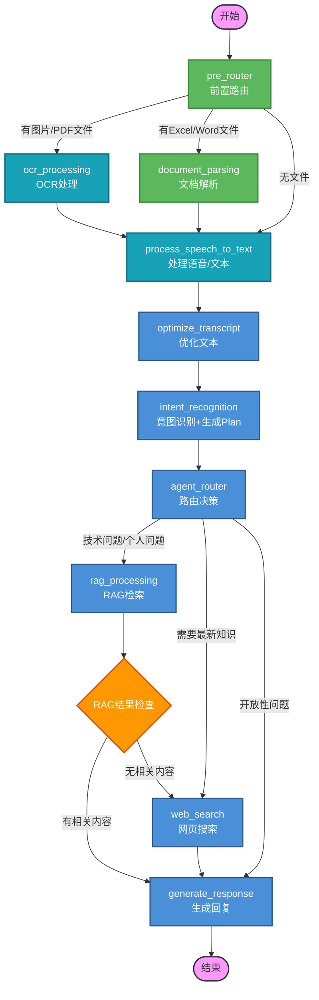

# Agent流程图

## 📊 LangGraph节点流程图



### 🎨 节点颜色说明

| 颜色 | 节点类型 | 包含节点 | 说明 |
|------|---------|---------|------|
| 🔵 蓝色 | LLM Node | `optimize_transcript`, `intent_recognition`, `agent_router`, `rag_processing`, `web_search`, `generate_response` | 云端大语言模型调用节点 |
| 🩵 青色 | Local Model Node | `process_speech_to_text`, `ocr_processing` | 本地模型节点（PaddleOCR/Whisper等） |
| 🟢 绿色 | Tool Node | `pre_router`, `document_parsing` | 纯功能/工具节点，不涉及模型调用 |
| 🟠 橙色 | Condition Node | `RAG_CHECK` | 条件判断节点 |
| 🟣 紫色 | Start/End | `START`, `END` | 开始和结束节点 |

---

## 📝 节点列表

| 节点名称 | 节点类型 | 功能描述 |
|---------|---------|---------|
| `pre_router` | 🟢 Tool Node | 前置路由，判断是否有文件上传（纯逻辑判断） |
| `ocr_processing` | 🩵 Local Model Node | OCR处理图片/PDF文件（PaddleOCR本地模型） |
| `document_parsing` | 🟢 Tool Node | 解析Excel/Word文档，提取问题文本 |
| `process_speech_to_text` | 🩵 Local Model Node | 语音转文字处理（Whisper/PaddleSpeech本地模型） |
| `optimize_transcript` | 🔵 LLM Node | 优化语音识别的文本（LLM润色） |
| `intent_recognition` | 🔵 LLM Node | 意图识别并生成执行计划（LLM分析） |
| `agent_router` | 🔵 LLM Node | 根据意图决定路由（LLM分类决策） |
| `rag_processing` | 🔵 LLM Node | RAG检索增强生成（LLM+向量检索本地知识库） |
| `web_search` | 🔵 LLM Node | 网页搜索获取最新知识（ReAct Agent，自主调用搜索工具） |
| `generate_response` | 🔵 LLM Node | 统一生成最终回复，整合内容、标注数据源、温和回答 |

---

## 🔗 边定义

### 🟠 条件边（Conditional Edge）

#### 1. pre_router → 下一步
- **"file_ocr"** → `ocr_processing`
- **"file_document"** → `document_parsing`
- **"text_input"** → `process_speech_to_text`

#### 2. agent_router → 下一步
- **"rag_processing"** → `rag_processing`（技术问题/个人问题）
- **"web_search"** → `web_search`（需要最新知识）
- **"generate_response"** → `generate_response`（开放性问题）

#### 3. RAG结果检查 → 下一步
- **有相关内容** → `generate_response`（整合RAG结果生成回复）
- **无相关内容** → `web_search`（回退到网页搜索）

### ⚪ 普通边（Normal Edge）

```
ocr_processing → process_speech_to_text
document_parsing → process_speech_to_text
process_speech_to_text → optimize_transcript
optimize_transcript → intent_recognition
intent_recognition → agent_router
web_search → generate_response
generate_response → END
```

---

## 📌 状态定义

```python
class AgentState(TypedDict):
    input_text: str                                    # 用户输入文本
    transcript: str                                    # 语音转文字结果
    optimized_text: str                                # 优化后的文本
    intent: Dict[str, Any]                             # 意图识别结果
    route_decision: str                                # 路由决策
    response: str                                      # 最终回复
    history: Annotated[List[Dict[str, str]], operator.add]  # 对话历史
    messages: Annotated[List, operator.add]            # 消息列表
    file_path: str                                     # 文件路径
    file_type: str                                     # 文件类型
    ocr_result: Dict[str, Any]                         # OCR结果
    document_content: str                              # 文档内容
    pre_route: str                                     # 前置路由结果
    rag_result: Optional[str]                          # RAG检索结果
    rag_sources: Optional[List[str]]                   # RAG数据源列表
    web_search_result: Optional[str]                   # 网页搜索结果
    web_sources: Optional[List[str]]                   # 网页数据源列表
```

---

## 🎯 路由决策逻辑

### agent_router 决策规则

| 问题类型 | 路由目标 | 说明 |
|---------|---------|------|
| 技术问题 | `rag_processing` | 从本地知识库/博客检索相关技术内容 |
| 个人问题 | `rag_processing` | 从个人简历/项目经验库检索 |
| 最新知识 | `web_search` | 需要实时/最新信息，走网页搜索 |
| 开放性问题 | `generate_response` | 闲聊、建议类问题直接生成回复 |

### RAG结果检查逻辑

```python
def check_rag_result(state: AgentState) -> str:
    if state.get("rag_result") and len(state["rag_result"]) > 0:
        return "has_content"  # 有相关内容，进入生成回复
    else:
        return "no_content"   # 无相关内容，回退到网页搜索
```

---

## 🤖 web_search ReAct Agent 详解

`web_search` 节点是一个 **LangGraph ReAct Agent**，通过 ReAct 范式（思考→行动→观察循环）自主调用搜索工具。

### ReAct 工作流程

```
用户问题: "2024年最新的大模型技术有哪些？"
    ↓
┌─────────────────────────────────────────────┐
│           ReAct Agent 循环                   │
│                                             │
│  Thought: 用户想了解最新的大模型技术，        │
│           我需要搜索相关信息                  │
│      ↓                                      │
│  Action: tavily_search("2024 大模型技术")    │
│      ↓                                      │
│  Observation: [搜索结果列表...]              │
│      ↓                                      │
│  Thought: 已获取搜索结果，需要整理关键信息    │
│      ↓                                      │
│  Action: get_search_sources("2024 大模型")  │
│      ↓                                      │
│  Observation: [来源链接列表...]              │
│      ↓                                      │
│  Thought: 信息已足够，可以输出结果           │
│      ↓                                      │
│  Final Answer: 整理后的搜索结果              │
└─────────────────────────────────────────────┘
    ↓
输出: 搜索内容 + 来源列表
```

### 可用工具

| 工具名称 | 功能描述 | 输入 | 输出 |
|---------|---------|------|------|
| `tavily_search` | 使用Tavily进行网页搜索 | query: 搜索关键词 | JSON格式的搜索结果 |
| `get_search_sources` | 获取搜索结果的来源链接 | query: 搜索关键词 | 来源链接列表 |

### 代码结构

```python
def web_search(state):
    from langgraph.prebuilt import create_react_agent
    from langchain_core.tools import tool
    
    @tool
    def tavily_search(query: str) -> str:
        """使用Tavily进行网页搜索"""
        ...
    
    @tool
    def get_search_sources(query: str) -> str:
        """获取搜索结果的来源链接"""
        ...
    
    react_agent = create_react_agent(
        model=llm,
        tools=[tavily_search, get_search_sources],
        state_modifier=system_prompt
    )
    
    result = react_agent.invoke({"messages": input_messages})
```

### 与普通搜索的区别

| 特性 | 普通搜索 | ReAct Agent |
|------|---------|-------------|
| 搜索策略 | 固定流程 | LLM自主决策 |
| 工具调用 | 预定义次数 | 按需多次调用 |
| 结果整理 | 简单拼接 | LLM智能整理 |
| 灵活性 | 低 | 高 |
| 可解释性 | 低 | 高（有思考过程） |

---

## 💬 generate_response 节点职责

该节点是**最终回复生成节点**，所有路径最终都汇聚到此节点，负责：

### 核心功能
1. **内容整合**：整合RAG检索结果或网页搜索结果
2. **数据源标注**：如有检索内容，标注数据来源（本地知识库/博客/网页）
3. **温和回答**：以温和、专业的态度面向面试官回答

### 输入来源

| 来源路径 | 输入内容 | 数据源 |
|---------|---------|--------|
| RAG有结果 | `rag_result` + `rag_sources` | 本地知识库/博客 |
| 网页搜索 | `web_search_result` + `web_sources` | 互联网 |
| 开放性问题 | 无额外内容 | LLM自身知识 |

### Prompt 示例

```
你是一位面试助手，需要根据检索到的内容回答面试官的问题。

问题：{optimized_text}
检索内容：{rag_result 或 web_search_result}
数据来源：{sources}

请：
1. 基于检索内容回答问题，如无检索内容则根据自身知识回答
2. 如果有检索内容，在回答末尾标注数据来源
3. 保持温和、专业的态度
4. 回答要简洁有力，突出重点
```
